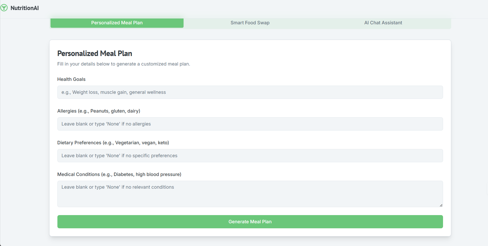

# 🧠 NutritionAI – Your AI-Powered Nutrition Assistant

  
*Empowering healthier eating with AI-driven insights and personalized plans.*

---

## 📖 Table of Contents
- [Introduction](#-introduction)
- [Key Features](#-key-features)
- [How to Use](#-how-to-use)
- [For Developers](#-for-developers)
  - [Tech Stack](#-tech-stack)
  - [Project Structure](#-project-structure)
  - [Setup Instructions](#-setup-instructions)
  - [Contributing](#-contributing)
- [License](#-license)
- [Contact](#-contact)

---

## 🌟 Introduction
**NutritionAI** is an innovative web application that leverages artificial intelligence to simplify healthy eating. Whether your goal is weight loss, muscle gain, or better nutrition, NutritionAI offers personalized meal plans, smart food swaps, and real-time dietary advice—all tailored to your unique needs.

This project combines cutting-edge AI with an intuitive user interface to make nutrition accessible and actionable for everyone.

---

## ✨ Key Features
- **🥗 Personalized Meal Plan Generator**  
  Generate meal plans customized to your dietary preferences, health goals, and allergies.

- **🔁 Smart Food Swap**  
  Discover healthier or allergy-friendly food alternatives suggested by AI.

- **💬 AI Nutrition Chat Assistant**  
  Get instant answers to your nutrition questions or meal suggestions via an AI-powered chat.

---

## 🚀 How to Use
1. **Access NutritionAI**  
   Use the [live app](#) *(link TBD)* or set it up locally (see [Setup Instructions](#-setup-instructions)).

2. **Pick a Feature**  
   Choose from Meal Plan Generator, Smart Food Swap, or Chat Assistant.

3. **Enter Your Info**  
   Provide details like goals, preferences, or questions.

4. **View Results**  
   Hit the green button to see your meal plan, swap, or chat response.

5. **Tweak & Repeat**  
   Adjust your inputs for updated results anytime.

---

## 🛠️ For Developers

### 🧑‍💻 Tech Stack
- **Frontend**: React.js  
- **Backend**: Node.js with Express  
- **Database**: Firebase Firestore  
- **AI Integration**: Custom models for meal planning, swaps, and chat  
- **Hosting**: Firebase Hosting

---

### 📂 Project Structure
```plaintext
NutritionAI/
├── .env                     # Environment variables
├── .gitignore              # Git ignore rules
├── README.md               # Project overview
├── package.json            # NPM dependencies and scripts
├── tailwind.config.ts      # Tailwind CSS configuration
├── tsconfig.json           # TypeScript config
├── next.config.ts          # Next.js config
├── postcss.config.mjs      # PostCSS config
├── apphosting.yaml         # Firebase hosting config
└── src/
    ├── app/
    │   ├── layout.tsx      # App-wide layout
    │   ├── page.tsx        # Home page
    │   └── globals.css     # Global styles
    ├── components/
    │   ├── Hero.tsx        # Hero section UI
    │   ├── Navbar.tsx      # Navigation bar
    │   └── Footer.tsx      # Footer component
    ├── lib/
    │   └── api.ts          # API interaction logic
    └── utils/
        └── helpers.ts      # Utility functions
```
---

### ⚙️ Setup Instructions
Follow these steps to run NutritionAI on your machine:  
1. **Prerequisites**  
   - Install [Node.js](https://nodejs.org/) (v14 or higher)  
   - Install [npm](https://www.npmjs.com/) (v6 or higher)  

2. **Clone the Project**  
   ```bash
   git clone https://github.com/your-repo/nutritionai.git
   cd nutritionai
   ```

3. **Install Dependencies**  
   ```bash
   npm install
   ```

4. **Run the App**  
   ```bash
   npm run dev
   ```

5. **Open in Browser**  
   Navigate to [http://localhost:9002](http://localhost:9002).

6. **Optional: Build for Production**  
   ```bash
   npm run build
   ```
---

### 🤝 Contributing
We’d love your help to improve NutritionAI! Here’s how:  
- **Fix Bugs**: Spot and resolve issues.  
- **Add Features**: Propose or build new tools.  
- **Enhance AI**: Share data or ideas to refine AI accuracy.  

**Steps to Contribute**:  
1. Fork the repo.  
2. Create a branch (`git checkout -b feature/xyz`).  
3. Commit changes (`git commit -m "Describe your change"`).  
4. Push to your fork (`git push origin feature/xyz`).  
5. Submit a pull request.

---

## 📜 License
Licensed under the [MIT License](LICENSE).

---

## 📬 Contact
Have questions? Reach out:  
- [GitHub Issues](https://github.com/your-repo/nutritionai/issues)  
- [LinkedIn](https://www.linkedin.com/in/rixscx)  

---

❤️ **Thanks for checking out NutritionAI!**  
We’re excited to help you eat smarter. Let us know what you think!
